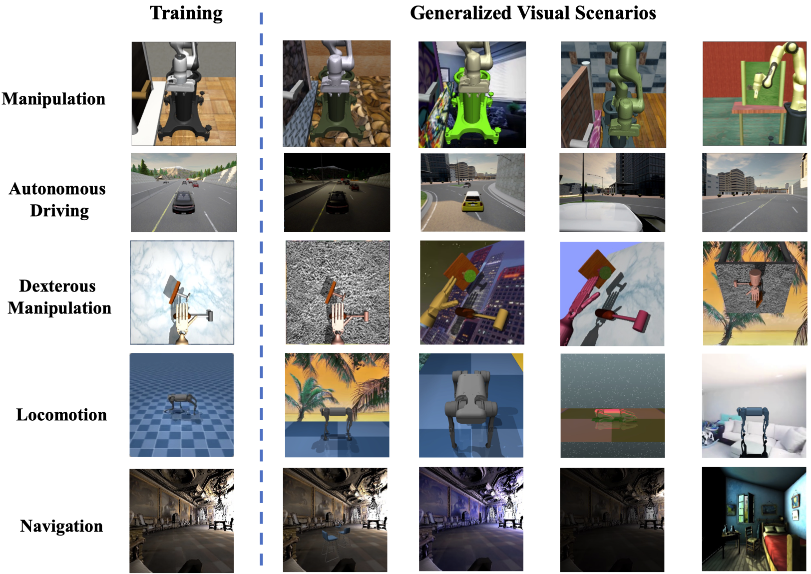

# RL-ViGen: A Reinforcement Learning Benchmark for Visual Generalization
[Website](https://gemcollector.github.io/RL-ViGen/) | [Paper](https://arxiv.org/abs/2307.10224)

We have released RL-ViGen -- a **R**einforcement **L**earning Benchmark for **Vi**sual **Gen**eralization. It specifically specifically designs to tackle the visual generalization problem.
Our benchmark comprises five major task categories, namely, manipulation, navigation, autonomous driving, locomotion, and dexterous manipulation. Concurrently, it encompasses five classes of generalization types: visual appearances, camera views, lighting changes, scene structures, and cross-embodiments. Furthermore, RL-ViGen integrates seven of the most currently favored visual RL and generalization algorithms, solidifying its broad applicability in the field.


<p align="center">
  <br />
  <a href="./MODEL_CARD.md"></a>
  <a href="./LICENSE"></a>
  <a href="Python 3.8"></a>
  <a href="https://github.com/psf/black"></a>
</p>


<p align="center">
  

[comment]: <> (  )

[comment]: <> (  )

[comment]: <> (  )

[comment]: <> (  )

[comment]: <> (  )

[comment]: <> (  )

[comment]: <> (  )

[comment]: <> (  )

[comment]: <> (  )
 </p>

[comment]: <> (## Method)

[comment]: <> (DrQ-v2 is a model-free off-policy algorithm for image-based continuous control. DrQ-v2 builds on [DrQ]&#40;https://github.com/denisyarats/drq&#41;, an actor-critic approach that uses data augmentation to learn directly from pixels. We introduce several improvements including:)

[comment]: <> (- Switch the base RL learner from SAC to DDPG.)

[comment]: <> (- Incorporate n-step returns to estimate TD error.)

[comment]: <> (- Introduce a decaying schedule for exploration noise.)

[comment]: <> (- Make implementation 3.5 times faster.)

[comment]: <> (- Find better hyper-parameters.)

[comment]: <> (<p align="center">)

[comment]: <> (  )

[comment]: <> (</p>)

[comment]: <> (These changes allow us to significantly improve sample efficiency and wall-clock training time on a set of challenging tasks from the [DeepMind Control Suite]&#40;https://github.com/deepmind/dm_control&#41; compared to prior methods. Furthermore, DrQ-v2 is able to solve complex humanoid locomotion tasks directly from pixel observations, previously unattained by model-free RL.)

[comment]: <> (<p align="center">)

[comment]: <> (  )

[comment]: <> (  )

[comment]: <> ( </p>)


## Intallation
To install our benchmark, please follow the instructions in [INSTALLATION.md](INSTALLATION.md).
<!-- 
### Create a conda environment
This basic conda env can serve for DM-Control, CARLA and Robosuite.
```
bash install_conda.sh
``` -->

<!-- ### Installation of CARLA
We apply CARLA 0.9.10 which is a stable version in our benchmark.

- you should download the CARLA 0.9.10 first: 
```
wget https://carla-releases.s3.eu-west-3.amazonaws.com/Linux/CARLA_0.9.10.tar.gz
```


### Installation of Robosuite
we have employed the `1.4.0` version of Robosuite, concurrently utilizing mujoco version `2.3.0` as the underlying simulator engine.
we have incorporated all the relevant components associated with Robosuite in the first creating conda step.

### Installation of Habitat
Since Habitat applies a different `hydra` version, we need to create a new conda environment for Habitat.
```
bash install_habitat.sh
```
1. We are using Gibson scene datasets for our experiment. You can find instructions for downloading the dataset [here](https://github.com/facebookresearch/habitat-sim/blob/main/DATASETS.md#gibson-and-3dscenegraph-datasets).

2. Next we need the episode dataset for the experiments. You can get the training and validation dataset from [here](https://dl.fbaipublicfiles.com/habitat/data/datasets/pointnav/gibson/v1/pointnav_gibson_v1.zip) and place it in the ./data folder under the path : `data/datasets/pointnav/gibson/v1/`.


### Installation of Adroit
Our Adroit implementation is originated from [VRL3](https://github.com/microsoft/VRL3).

In case the mujoco rendering bug, we recommand you to create a new adroit conda env for your experiment as follow:
```
bash install_adroit.sh
``` -->


## Code Structure
- `algos`: contains the implementation of different algorithms.
- `cfgs`: contains the hyper-parameters for different algorithms and each tasks.
- `envs`: various RL-ViGen benchmark environments. In addtion, each sub-folder contains specific `README.md` for the introduction of the environment.
- `setup`: the installation scripts for conda envs.
- `third_party`: submodules from third parties. We won't frequently change the code in this folder.
- `wrappers`: includes the wrappers for each environment.
- `scripts`: includes scripts that facilitate training and evaluation. 


## Extra Datasets
The algorithms will use the [Places](http://places2.csail.mit.edu/download.html) dataset for data augmentation, which can be downloaded by running
```
wget http://data.csail.mit.edu/places/places365/places365standard_easyformat.tar
```
After downloading and extracting the data, add your dataset directory to the datasets list in `cfgs/aug_config.cfg`.

## Training

<!-- ### CARLA
- For CARLA, you should start the CARLA engine first:
```
SDL_HINT_CUDA_DEVICE=0 ./CarlaUE4.sh -fps 20 --carla-port=2022
```
The `SDL_HINT_CUDA_DEVICE` is the running GPU id, and we can set the `carla-port` to run multiple CARLA instances.

- Third, you should run the code as the following way:
```
LD_PRELOAD=/usr/lib/x86_64-linux-gnu/libffi.so.7 bash carlatrain.sh
``` -->

### Habitat, Robosuite, Locomotion
```
cd RL-ViGen/
bash scripts/train.sh
```
### CARLA
```
cd RL-ViGen/
bash scripts/carlatrain.sh
```

## Evaluation
For evaluation, you should change `model_dir` to your own saved model folder first. Regarding  `Robosuite` , `Habitat`, and `CARLA`, we can run the evaluation code as follow:
```
cd RL-ViGen/
bash scripts/eval.sh 
```
You should change the `env`, `task_name`, `test_agent` for different evaluation in the `eval.sh`.

For `DM-Control`, we can run the evaluation code as follow:
```
cd RL-ViGen/
bash scripts/locoeval.sh
```

For more details, please refer to the `README.md` files for each environment in the `env/` directory.


alll the Adroit configureation is on the branch `ViGen-adroit`.


## Change Log
* **[07-20-2023]** Accelerate the speed of DMcontrol in video background setting. 
* **[06-01-2023]** Initial code release.


## Acknowledgements
Our training code is based on [DrQv2](https://github.com/facebookresearch/drqv2). 
And we also thank the codebase of [VRL3](https://github.com/microsoft/VRL3), [DMC-GB](https://github.com/nicklashansen/dmcontrol-generalization-benchmark), [SECANT](https://github.com/DrJimFan/SECANT), and [kyoran](https://github.com/kyoran/CarlaEnv-Benchmark). We also thank [Siao Liu](https://github.com/siaoliu) and [Xinning Zhou](https://github.com/coderlemon17) for their careful checking of the code.

## License
The majority of DrQ-v2, DMCGB, VRL3 is licensed under the MIT license. Habitat Lab, dmc2gym, mujoco-py are also licensed under the MIT license. However portions of the project are available under separate license terms: DeepMind,  mj_envs, and mjrl is licensed under the Apache 2.0 license. Gibson based task datasets, the code for generating such datasets, and trained models are distributed with [Gibson Terms of Use](https://storage.googleapis.com/gibson_material/Agreement%20GDS%2006-04-18.pdf) and under [CC BY-NC-SA 3.0 US license](https://creativecommons.org/licenses/by-nc-sa/3.0/us/). CARLA specific assets are distributed under CC-BY License. The ad-rss-lib library compiled and linked by the [RSS Integration build variant](Docs/adv_rss.md) introduces [LGPL-2.1-only License](https://opensource.org/licenses/LGPL-2.1). Unreal Engine 4 follows its [own license terms](https://www.unrealengine.com/en-US/faq).

If you find our work useful in your research, please consider citing our work as follows:

## Citations

```
@article{yuan2023rl,
  title={RL-ViGen: A Reinforcement Learning Benchmark for Visual Generalization},
  author={Yuan, Zhecheng and Yang, Sizhe and Hua, Pu and Chang, Can and Hu, Kaizhe and Wang, Xiaolong and Xu, Huazhe},
  journal={arXiv preprint arXiv:2307.10224},
  year={2023}
}
```
